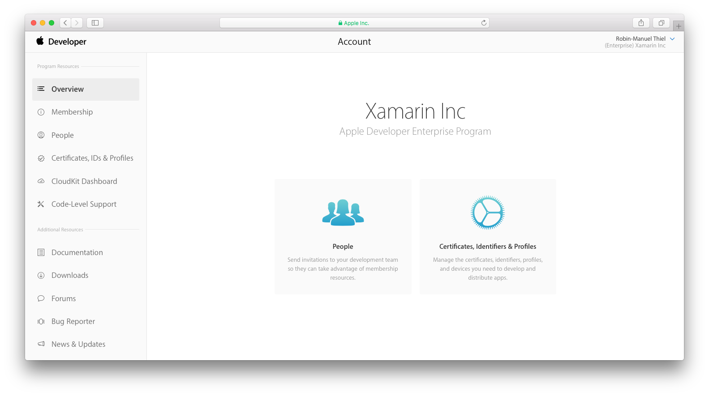
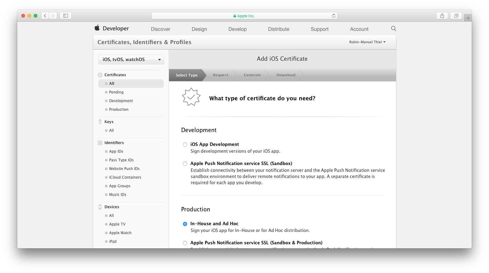
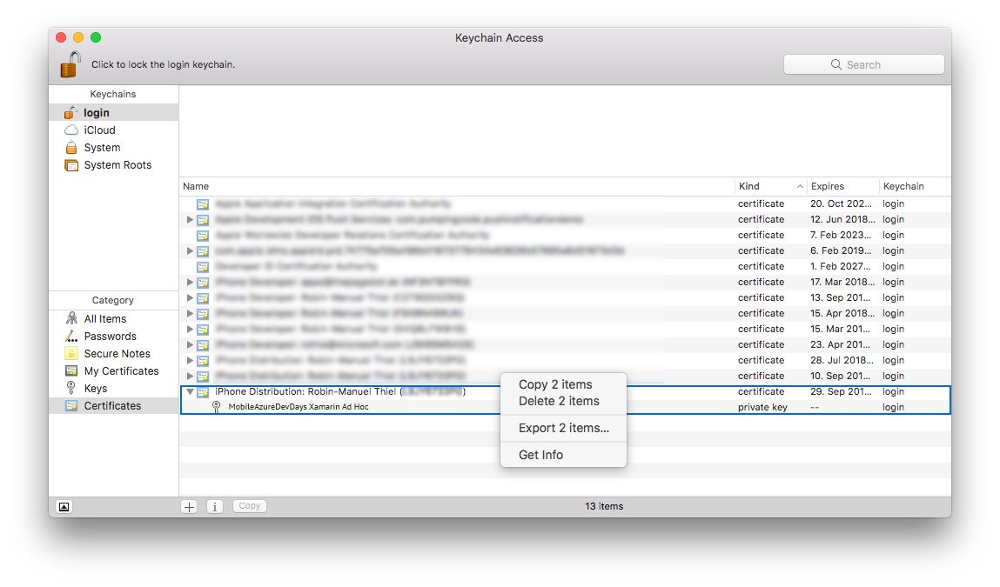
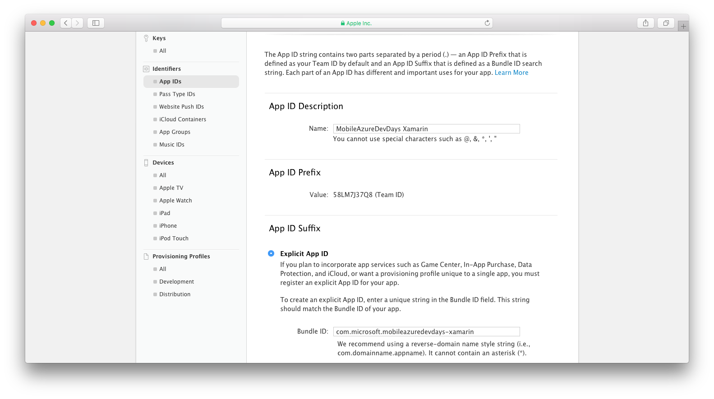
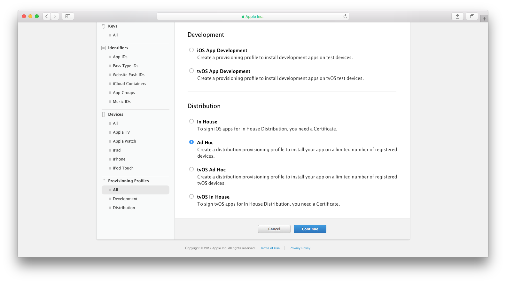
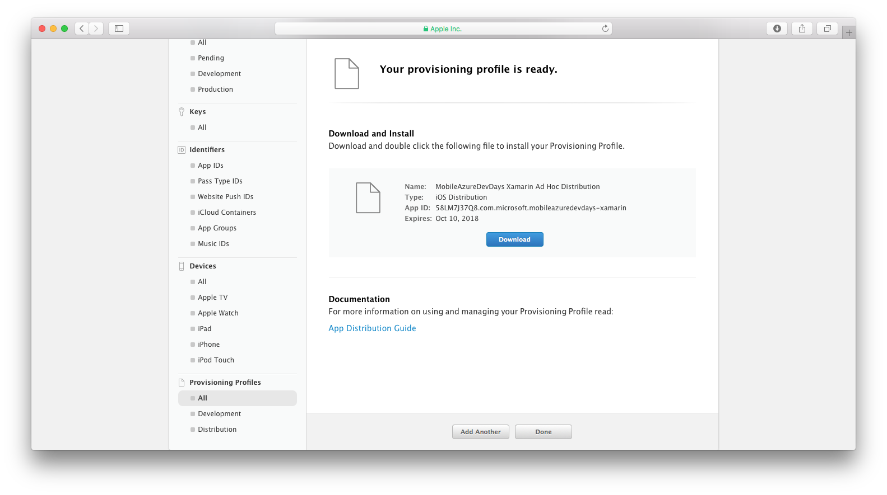

# Create Certificates and Provisioning Profiles
## iOS
### 1. Make sure you have a Production Certificate
When distributing iOS apps, they must be signed with a *Production Certificate*, that you can get from the [Apple Developer Center](https://developer.apple.com/account). Log into your account and navigate to the **Certificates, Identifiers & Profiles** section.

At the **Certificates** section you can get an overview of all certificates, that have been created for your account.

> **Hint:** If there already is a *iOS Distribution* certificate, you should use this. Organizations usually do not need more than one, so download the existing one and install it to your machine.

To create a new certificate, click the **Add** button in the top-right corner and select **Ad Hoc** to create a certificate for distribution.

Follow the steps to Request a Certificate from a Certificate Authority using **Keychain Access** on your Mac and upload it to the Apple Developer Portal.

### 2. Export the certificate
***TODO: BLALVBLBLBLA***

### 3. Create an App Identifier
Back in the Apple Developer Portal, we now need a unique identifier for the application, so that it can be recognized by Apple. For this, create a new one using the **Add** in the *App IDs* tab of the *Identifiers* section. Give it a name and make sure, that the **Bundle ID** matches the *Bundle Identifier* from your **Info.plist** file in the iOS project.

Click **Continue**, check the inputs and confirm with **Register**.

### 4. Register devices
If you don not have an Apple Developer Enterprise Account and created an In-House Distribution profile in the first step, you need to define the devices that should be allowed to install your application. You can add devices using their [UDID](http://whatsmyudid.com/) in the **Devices** section of the portal.

### 5. Create a Provisioning Profile
The Provisioning Profile bundles all the information from above together and is used to describe the type of deployment of our application. Create a new oen for our app, inside the **Provisioning Profiles** section. As we want to create a profile to distribute the application, select **Ad Hoc** Distribution and confirm with **Continue**.

> **Hint:** If you have an Apple Developer Enterprise Account and don't want to specify the devices, that your app can be installed on, you can also choose **In House** distribution here.

In the next steps, you will be asked to choose an App ID and distribution certificate. Both times, choose the ones we created in the steps above. You will also be asked to picked from the registered devices, to allow installation on them.

Once you gone through these steps, you can give the Provisioning Profile a name and **Download** it afterwards.

